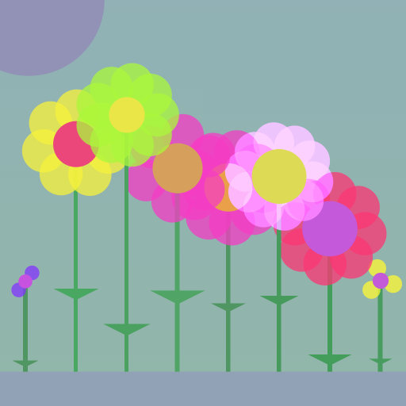

<h1>nd-genuary32nd-plants-chatgpt3-001</h1>

<p align="center">
  
</p>

The code for the generative artwork **nd-genuary32nd-plants-chatgpt3-001**. Find more info at https://nerddis.co/nd-genuary32nd-plants-chatgpt3-001 or mint the token via https://www.fxhash.xyz/generative/slug/nd-genuary32nd-plants-chatgpt3-001

------

- [Development](#development)
- [Build](#build)

------

## Development

Install the dependencies:
```
npm install
```

Then start local the development server:
```
npm start
```

This should open [localhost:3000/?target=http://localhost:3301](http://localhost:3000/?target=http://localhost:3301/)

## Build

```
npm run build
```
